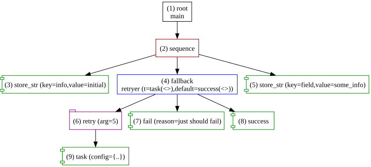

<p align="center">
    
</p>

<h1 align="center">Forester</h1>
<p align="center"><b>A functionally-oriented language and a fast, typed runtime for behavior trees — built to orchestrate robots and AI agents alike.</b></p>

<p align="center">
  
</p>

## What is Forester

Forester is a language *and* a Rust runtime for describing and executing **behavior trees**,
the same control-flow model used to drive NPCs in games, robots in the field, and increasingly, LLM-based agents.
A behavior tree separates *what your system should decide* from *how each step gets done*. 
Forester's job is to make that separation cheap: you write the decision logic once, in a real language with types, reusable abstractions, 
and reference semantics plus you plug in whatever actually does the work, whether that's a motor controller, a REST call, or an LLM completion.

The language itself is functionally oriented: sequences, fallbacks, and decorators compose into arbitrarily complex behavior 
through higher-order trees and lambdas, the same way small functions compose into large programs. 
That's what lets a compact core cover this much ground, few building blocks, no ceiling on what you build with them.

The runtime matches that ambition. Tasks run **sync or async**, **local or remote**, **sequentially or in parallel** 
with scheduling, retries, timeouts, and distribution handled for you, so your tree logic stays about the *logic*, 
not the plumbing.

## Two places this fits (initially)

The same core engine and DSL are already used for two quite different jobs, and that's deliberate:

**🤖 Robotics & industrial systems**
Deterministic, safety-critical control flow with real hardware in the loop.
Forester ticks reactively, exports to **ROS Nav2**, and integrates with simulators like Webots,
so you can validate a tree against a simulated robot before it ever touches hardware.

**🧠 AI agents**
Structured, inspectable orchestration for LLM-driven systems as an alternative to hand-rolled if/else chains and opaque agent loops. 
A tool call or LLM response can land on the **Blackboard**, and the next node reads it by reference and no glue code required. 
Because the tree is a real artifact (not a prompt), you get retries, fallbacks, and tracing for free.

## A taste of the language

```
import "std::actions"

root main sequence {
    store("info", "initial")
    retryer(task({}), success())
    store("field", "some_info")
}

fallback retryer(t: tree, default: tree) {
    retry(5) t(..)
    fail("just should fail")
    default(..)
}

impl task(config: object);
```

A few things that aren't typical for a behavior-tree DSL:

- **Higher-order trees**: `retryer` takes other trees (`t`, `default`) as parameters and invokes them with `(..)`. Write retry/fallback/logging patterns once, reuse them everywhere, no copy-paste.
- **A real type system**: numbers, strings, bools, arrays, objects, and trees themselves are all typed, with compile-time checks (including numeric overflow).
- **Pointers into the Blackboard**: an argument can be a live reference to shared state, resolved at invocation time rather than captured at definition time. This is what makes the AI-agent integration painless.
- **Lambdas**: anonymous, inline subtrees for the cases that don't deserve a name.

[Read the full book →](https://forester-bt.github.io/forester/)

## Try it

```rust
#[test]
fn smoke() {
    let mut sb = SimulatorBuilder::new();
    sb.root(test_folder("simulator/smoke"));
    sb.profile(PathBuf::from("sim.yaml"));
    sb.main_file("main.tree".to_string());

    let mut sim = sb.build().unwrap();
    sim.run().unwrap();
}
```

or from the console:

```shell
forest sim --root tree/tests/simulator/smoke/ --profile sim.yaml
```

## What's in the box

| | |
|---|---|
| **Language** | Sequences, fallbacks, parallel, decorators, higher-order trees, lambdas, a typed parameter system |
| **Runtime** | Sync/async and local/remote task execution, parallelization, retries and timeouts, a Blackboard for shared state |
| **Analysis** | Visualization, execution tracing, a simulator for testing trees before deployment |
| **Integrations** | ROS Nav2 export, Webots, remote-action clients (Rust, Python) |
| **Tooling** | `f-tree` CLI, IntelliJ plugin |

## Why behavior trees

Behavior trees give you a small, well-understood set of composable primitives (sequence, fallback, decorator) with clean modularity and a real separation between orchestration logic 
and business logic — a stronger abstraction than ad hoc state machines or hardcoded control flow, without the sprawl of a full workflow engine.

If you're new to the concept:
- [Chris Simpson — Behavior trees for AI: how they work](https://outforafight.wordpress.com/2014/07/15/behaviour-behavior-trees-for-ai-dudes-part-1/)
- [Introduction to behavior trees](https://robohub.org/introduction-to-behavior-trees/)
- [State machines vs. behavior trees](https://www.polymathrobotics.com/blog/state-machines-vs-behavior-trees)

## Documentation

The full book lives at [forester-bt.github.io/forester](https://forester-bt.github.io/forester/) — language reference, runtime internals, analysis tools, and integrations.

## Writing

- [Part I — Orchestration with behavior trees: simulation](https://medium.com/@zhguchev/forester-the-orchestration-with-behaviour-trees-part-i-simulation-b10867aab8db)
- [Part II — A language above trees: higher-order trees](https://medium.com/@zhguchev/forester-part-ii-why-do-we-need-to-have-a-language-above-trees-bdf046bf4a73)
- [Part III — Changing the runtime tree on the fly: trimming](https://medium.com/@zhguchev/forester-part-iii-trimming-change-the-runtime-tree-on-the-fly-185a6e61a7aa)

## Contributing

The project is under active development again, and there's plenty of room to help — from language features to integrations to docs. 
See [`CONTRIBUTING.md`](CONTRIBUTING.md).

## License

Apache License, Version 2.0. See [`LICENSE`](LICENSE).

## Logo

Logo by [bunny on Freepik](https://www.freepik.com/free-vector/logo-with-abstract-tree_29192741.htm#from_view=detail_alsolike).