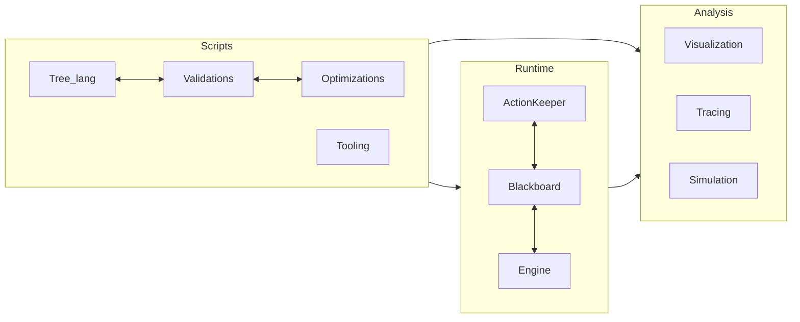

# Components 

All in all, the framework provides the following components :

## Scripts
That section describes the language and a way how the users can describe the logic of the trees:

### Tree lang
The scripts. They are usually can be stored as a folder with one or more `root` node which will be executed afterwords.
The syntax of the language takes a vast part of the book and described in the following [chapter](./intro_lang.md)

### Validations and Optimizations
These parts come with static analyzer and are conducted when the users compile the scripts into the runtime tree.
They are described in the corresponding sections [Validations](./validations.md) and [Optimizations](./optimizations.md)

### Tools
There are some number of extensions for ides to alleviate the writing scripts and running the trees. 
The detailed description is in the chapter [Tools](./tools.md)

## Runtime
That is the central part of the framework. The runtime orchestrates the tree execution alongside \
with the storing and manipulating some data and actions.

### Engine
The main orchestrator. It is described in the chapter [Engine](./engine.md)

### Blackboard
The component which is responsible for the storing the intermediate data that can be passing across the tree.
The mechanism of working is described in that [chapter](./bb.md)

### ActionKeeper
The component stores and processes the user implemented actions (*tasks* or *conditions*).
The chapter [Action](./actions.md) describes how to interact with ActionKeeper.

## Analysis
This component helps to analyse the trees and also interacts with them in an easy way

### Visualization
The users can visualize the tree using graphviz format.
This [section](./viz.md) explains how to do that.

### Tracing
The users can turn on some extra logging that can float up some extra meta information \ 
helpful to design and debug the trees. This [page](./trace.md) explains how to handle the tracing.

### Simulation
The users can run the tree with some stubs instead of the real implementations of the actions. \ 
It can help swiftly define and correct the behavior of the tree itself.
This [chapter](./sim.md) describes it.
