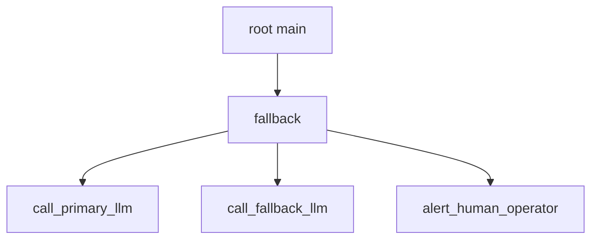

# Fallback (Selector) Nodes

A **Fallback** (also known as a Selector) node executes its child nodes in order from left to right until one child returns `Success`. If all children return `Failure`, the Fallback node returns `Failure`.

In the Forester DSL, fallback nodes are declared using the `fallback` keyword (or its reactive variant `r_fallback`).

---

## Standard Fallback (`fallback`)

### Execution Flow & Rules
1. **Initial Tick**: Starts at the first child node.
2. **Child Failure**: Moves to the next child. If the last child fails, the fallback returns `Failure`.
3. **Child Success**: Immediately short-circuits remaining children and returns `Success`.
4. **Child Running**: Halts evaluation and returns `Running`. On the next tick, execution resumes at the running child.
5. **Reset / Halt**: If restarted or aborted, evaluation resets back to the first child.

### Precondition Check Pattern

Fallbacks are commonly used to enforce preconditions before running an action (i.e. `[Precondition OR Action]`):

```f-tree
import "std::actions"

root main sequence {
    // If item is already held, skip move_to_item()
    fallback {
        is_item_in_hand(item = "battery_pack")
        move_to_item(item = "battery_pack")
    }
    
    pickup_item(item = "battery_pack")
}

impl is_item_in_hand(item: string);
impl move_to_item(item: string);
impl pickup_item(item: string);
```

### LLM Fallback Pattern (AI Agents)

Fallbacks provide a clean mechanism for multi-model LLM fallbacks without nested `try/except` blocks:

```f-tree
root main fallback {
    call_primary_llm({"model": "gpt-4o"})
    call_fallback_llm({"model": "claude-3-5-sonnet"})
    alert_human_operator({"reason": "All LLM APIs failed"})
}

impl call_primary_llm(config: object);
impl call_fallback_llm(config: object);
impl alert_human_operator(config: object);
```

### Flow Diagram



---

## Reactive Fallback (`r_fallback`)

An `r_fallback` **re-evaluates all preceding children on every tick**, even while a lower child is currently `Running`.

```f-tree
root main r_fallback {
    emergency_battery_low()    // Checked on EVERY tick
    perform_long_task()        // Returns Running for multiple ticks
    fallback_idle()
}

impl emergency_battery_low();
impl perform_long_task();
impl fallback_idle();
```

### Preemption Behavior
If `perform_long_task()` is `Running` and `emergency_battery_low()` evaluates to `Success` on a subsequent tick:
1. `r_fallback` immediately **halts** `perform_long_task()`.
2. `r_fallback` executes `emergency_battery_low()` and returns `Success`.
3. Lower nodes are safely preempted.
