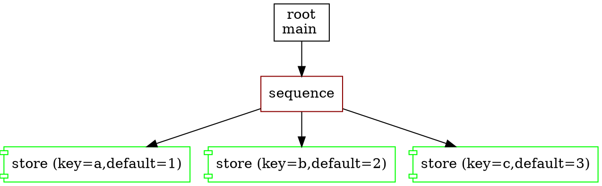

# Sequence

A Sequence node ticks all underlying nodes as long as they return `Success`.
Otherwise, when a child returns `failure` the sequence is aborted.

In the language, the tree definitions and lambda invocations of this element are marked with the key word `sequence`.

```f-tree
impl store(key:string, value:string); // store a string value to a key in blackboard

root main {
    sequence {
        store("a","1") // first tick and proceed if succeeded
        store("b","2") // sec tick and proceed if succeeded
        store("c","3") // thrd tick and finish if succeeded
    }
}
```

with a graph representation



## Common behaviour
- When it gets the first `tick` it switches to state `running`
- When a child returns `success` it proceeds to the next one and ticks it
  - if this is a final child, it returns `success`
- If a child returns `running`, the node returns `running` as well
- If a child returns `failure`, the node returns `failure` as well
- When a node is restarted or halted, the process starts from the beginning (see memory sequence for an exception)

## Intention
Often, it is used as a straight chain of instructions
```f-tree
// if the definition has only one child
// (root has only one child) '{''}' can be omitted
root main sequence {
        validate_env()
        perform_action()
        finish_and_save()
}

```

# Subtypes

There are 2 subtypes that bring a few subtleties to the common process.

## Memory Sequence

This sequence defines in the language with the keyword `m_sequence` and has the following peculiarity:
The sequence memorizes the children that have succeeded and skips them next time.

```f-tree
root main {
    retry(5) m_sequence {
        store("key",1)    // returns success
        perform_action()  // returns failure
        finish_and_save()
    }
}
```

The node `perform_action` returns `failure` and the decorator `retry` restarts `sequence`.
The main difference with a sequence is an execution starts from the node `perform_action` skipping the node `store`.

This memory persists even if the `m_sequence` is halted by a reactive flow node. The memory will only be reset once the final action has returned `success`.
That is, if `finish_and_save` returns `success`, the next iteration will start with `store` again.

## Reactive Sequence

This sequence defines in the language with the keyword `r_sequence` and has the following peculiarity:
The sequence restarts all children if they return either failure or running.

```f-tree
root main {
    r_sequence {
        store("key",1)    // returns success
        perform_action()  // returns running
        finish_and_save()
    }
}
```

The node `perform_action` returns `running` and the whole sequence returns `running`
but on the next tick it starts from the node `store` again.

`r_sequence` will halt the `running` child to allow a graceful shutdown if a prior child changes from `success` to `failure`. In the above example, if `store` returned `failure` on the second tick then `perform_action` would be halted before `r_sequence` returned `failure` itself.

Halting must be performed as quickly as possible. Note that currently only build-in flow, built-in decorator and sync action nodes are halted, async and remote actions are not.
