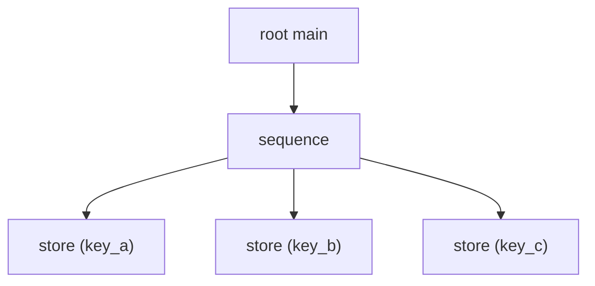

# Sequence Nodes

A **Sequence** node executes its child nodes in order from left to right as long as each child returns `Success`. If any child returns `Failure` or `Running`, the sequence halts further evaluation and immediately propagates that status up the tree.

In the Forester DSL, sequence nodes are declared using the `sequence` keyword (or its memory/reactive variants `m_sequence` and `r_sequence`).

---

## Standard Sequence (`sequence`)

### Execution Flow & Rules
1. **Initial Tick**: Starts at the first child node.
2. **Child Success**: Moves to the next child. If the last child succeeds, the sequence returns `Success`.
3. **Child Running**: Halts evaluation and returns `Running`. On the next tick, execution resumes at the running child.
4. **Child Failure**: Immediately aborts remaining children and returns `Failure`.
5. **Reset / Halt**: If restarted or aborted, execution starts back from the first child.

### Example

```f-tree
import "std::actions"

root main sequence {
    store("key_a", "1")  // Tick 1: proceed if Success
    store("key_b", "2")  // Tick 2: proceed if Success
    store("key_c", "3")  // Tick 3: finish with Success
}

impl store(key: string, value: string);
```

### Flow Diagram


```mermaid
graph TD
    Root["root main"] --> Seq["sequence"]
    Seq --> A["store (key_a)"]
    Seq --> B["store (key_b)"]
    Seq --> C["store (key_c)"]
```

---

## Sequence Variants

Forester provides two specialized sequence variants for state persistence and real-time reactive control loops:

### 1. Memory Sequence (`m_sequence`)

An `m_sequence` **remembers** which child nodes have already succeeded. When re-ticked (e.g. after a decorator retry or on subsequent ticks), it skips previously succeeded children and resumes execution at the first non-successful child.

```f-tree
root main sequence {
    retry(5) m_sequence {
        check_preconditions()  // Returns Success once
        execute_task()         // Returns Failure -> retry triggers m_sequence
        finish_and_cleanup()   // Execution resumes here without re-checking preconditions
    }
}
```

* **Memory Reset**: Memory persists until the entire sequence finishes with `Success` or is explicitly reset.

---

### 2. Reactive Sequence (`r_sequence`)

An `r_sequence` **re-evaluates all preceding children on every tick**, even if they succeeded on prior ticks. This ensures that preconditions remain valid while long-running lower nodes execute.

```f-tree
root main r_sequence {
    is_battery_ok()       // Re-checked on EVERY tick
    navigate_to_target()  // Returns Running for multiple ticks
    perform_docking()
}
```

* **Preemption & Halting**: If `is_battery_ok()` changes from `Success` to `Failure` while `navigate_to_target()` is `Running`, the `r_sequence` immediately halts `navigate_to_target()` and returns `Failure`.
* **Halting behavior**: Halting ensures graceful teardown of active synchronous and flow nodes before propagating state changes.
