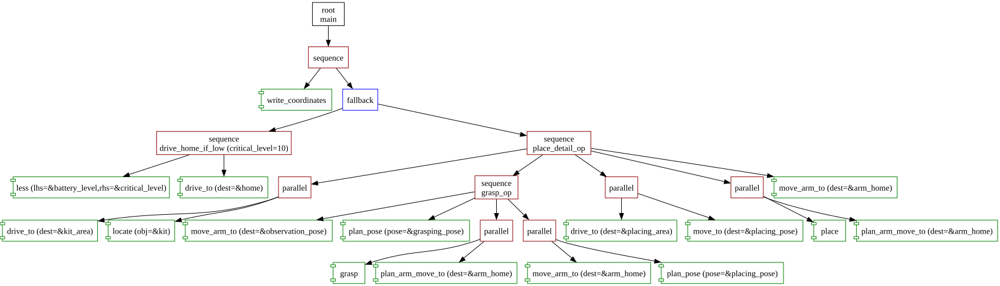

# Visualization

Forester can generate a visual diagram of any behavior tree project, rendering the full node graph as an SVG file. This makes it easy to review control flow, spot structural issues, and communicate tree logic to teammates.

---

## Prerequisites

Visualization uses [Graphviz](https://graphviz.org/download/) under the hood. Install it before running the `vis` command:

```shell
# macOS
brew install graphviz

# Ubuntu / Debian
sudo apt-get install graphviz

# Windows
winget install graphviz
```

---

## Example Output



---

## Usage

### CLI (`f-tree vis`)

```shell
f-tree vis --root project/ --main main.tree --tree main --output viz.svg
```

| Flag | Default | Description |
|---|---|---|
| `--root` | Current working directory | Path to the project root directory containing `.tree` files. |
| `--main` | `main.tree` | The entry `.tree` file to visualize. |
| `--tree` | First `root` definition found | Name of the specific `root` tree to visualize (required if the file has multiple roots). |
| `--output` | `<main-filename>.svg` | Output SVG file path. |

### From Rust

Visualization can also be triggered programmatically from Rust using the `ForesterBuilder` and `Visualizer` API:

```rust
use forester_rs::tracer::Tracer;
use forester_rs::visualizer::Visualizer;
use forester_rs::runtime::builder::ForesterBuilder;
use std::path::PathBuf;

fn main() {
    let mut fb = ForesterBuilder::from_file_system();
    fb.main_file("main.tree".to_string());

    let svg = Visualizer::build_svg(fb).expect("Visualization failed");
    std::fs::write("output.svg", svg).unwrap();
}
```
