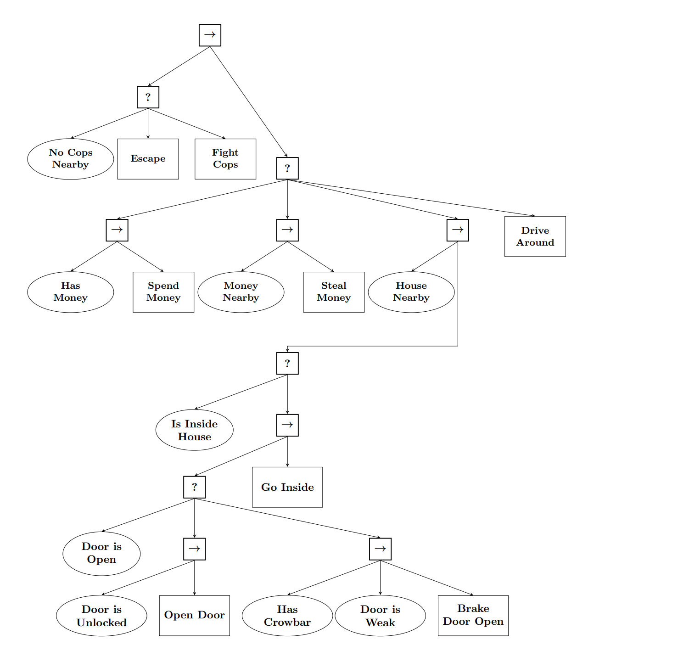

```
root example1 {
  fallback {
    sequence {
        equal(battery_status, "low") // predef condition that takes 2 args and cmp them 
        drive_to(home)              // means drive_to(dest = home) where home is a key in bb
    }
    main_part(grasp_operation)
  }
}

sequence main_part (grasp_op:tree) {
  parallel {
    drive_to(kit_area)
    impl locate_kit                 // user action, it needs to be registered and implemented
  }
  grasp_op
  parallel calibrate {              // calibrate is just a label
    drive_to(placing_area)
    move_to(placing_pose)
  }
  parallel arm_op {
    impl place                      
    plan_arm_move(arm_home)
  }  
  move_arm_to(arm_home)        
}
sequence grasp_operation {
  move_arm_to(observation_pose)
  impl plan_grasping_pose
  parallel {
     impl grasp
     plan_arm_move(arm_home)
  }
  parallel {
     move_arm_to(arm_home)   
     impl plan_placing_pose
  }
}
impl drive_to(dest:object)
impl move_to(pose:object)
impl move_arm_to(pose:object)
impl plan_arm_move(dest:object)
```
---


```
root simple_ex sequence {
    handle_door
    impl enter_room
}

fallback handle_door {
    equal(door_state,"open")      
    open_door
    sequence {
        test have_key
        impl unlock_door
        open_door
    }
    impl smash_door  
}

impl open_door

```

---


```
root ball fallback {
    try_to_place_to(ball,bin) // the objects in bb that denote ball and bin  
    impl ask_for_help
}

sequence try_to_place_to(obj:object, dest:object){
    fallback {
       cond ball_found(obj)
       impl find_ball(obj)       // find and set the coordinates of the ball to bb
    }
    fallback {
        close(obj)
        approach(obj)
    }
    fallback {
        test grasped(obj)
        grasp(obj)
    }
    fallback {
        close(dest)
        approach(dest)
    }
    fallback {
        test placed(obj)
        impl place(obj, dest)
    }
}

cond grasped(obj:object)
cond close(obj:object)
impl approach(obj:object)
impl grasp(obj:object)

```

---


```
impl pick(hand_obj:object)
impl approach(hand_obj:object)
impl place(hand_obj:object, target:object)
cond holding(cube:object)
cond close_to(obj:object)

sequence check_and_approach(trg:object){
    cond exists_trajectory(trg)
    approach(trg)
}

fallback approach_goal(goal:object){
    close_to(goal)
    check_and_approach(goal)
} 

fallback pick_cube(cube:object) {
    holding(cube)
    sequence {
        cond hands_free
        approach_goal(cube)
        pick(cube)
    }
}

root fallback {
    cond cube_on_goal(cube,goal)
    sequence {
        pick_cube(cube)
        approach_goal(goal) 
        place(cube,goal)
    }
}


```

---



---